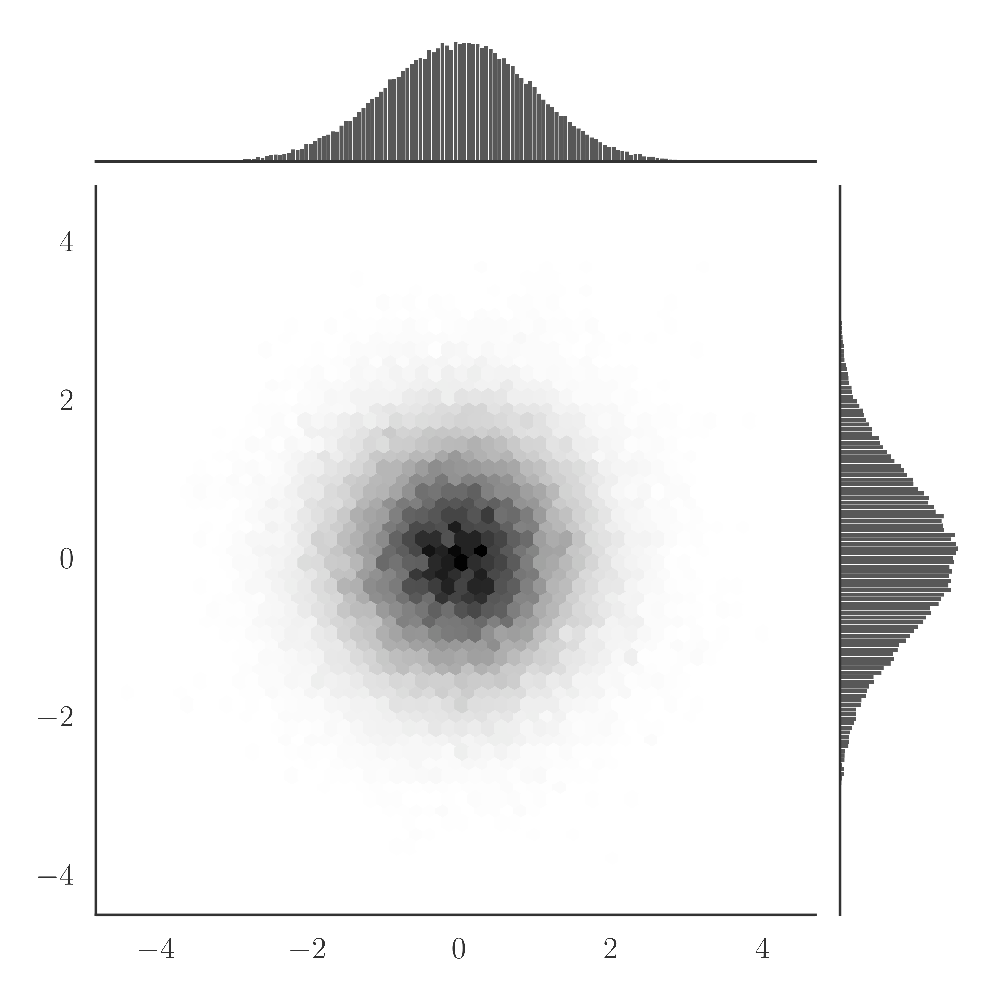

# CVS

<div align="center">

</div>

Markov chain Monte Carlo sampler for arbitrary continuous distribution $\Pi(x)$.

This package uses

1. Langevin Monte Carlo
2. Hamiltonian Monte Carlo
3. No-U-Turn Sampler

as backends.

# Description
## Langevin Monte Carlo (LMC)
LMC uses discretized Langevin dynamics as the proposal step of the Metropolis-Hastings sampling. Since the dynamics has $\Pi(x)$ as the fixed-point distribution in the $\Delta t \rightarrow 0$ limit, inefficient random-walk behaviors are suppressed compared to naive Metropolis samplers. To remove discretization artifacts, rejection process is necessary.

1. Proposal Step
$$x' = x + \nabla{\log{\Pi}(x)} \Delta t + \mathcal{N}(0,\ \sqrt{2\Delta t}^2)$$

2. Metropolis-Hastings Sampling
$$P_\mathrm{accept} = \min{[1,\ \frac{P(x|x')\Pi(x')}{P(x'|x)\Pi(x)}]}$$

## Hamiltonian Monte Carlo (HMC)
HMC samples momentum $p$ directly using the Gibbs sampler, and after that proposes a long-jump trial using Hamiltonian dynamics of $H(q,\ p) = \frac{p^2}{2} - \log{\Pi}(q)$. As the leap frog integrator is symplectic, $H$ approximately conserves along the path. To remove numerical errors rejection is still necessary, but the trial is rarely rejected even though the moving distance can quite long.

1. Sample $p$
$$p \sim \mathcal{N}(0,\ 1)$$

2. Calculate Hamiltonian Dynamics
$$(q',\ p') = \varphi_T(q,\ p)$$
where $\varphi_T$ denotes the discretized Hamiltonian dynamics starting from $(q,\ p)$.

3. Metropolis Sampling
$$P_\mathrm{accept} = \min{[1,\ \exp{(H(q,\ p) - H(q',\ p'))}}]$$

## NUTS
NUTS is an improved HMC with automated fine-tuning of integration time $T$. In the long-jump process, NUTS extends path using doubling either forward ($\Delta t > 0$) or backward ($\Delta t < 0$), and stops when it starts to U-turn. After calculating the path, next state is randomly chosen from the leaves of the binary doubling tree. To ensure the detailed-balance relation, slice sampling is performed.

1. Sample $p$
$$p \sim \mathcal{N}(0,\ 1)$$

2. Sample $u$
$$u \sim \mathrm{Uniform}[0,\ e^{-H(q,\ p)}]$$

3. Construct Tree by Doubling
   1. Choose sign
   2. Compute $(q',\ p') = \varphi^{2^l}_{\pm\Delta t}(q,\ p)$ from the corresponding end
   3. If any of the subtrees violates the NUT criterion, abort building tree
   4. Double $l$

4. Select Next State

NOTE: This package implements the ``efficient NUTS'', which does not store the binary tree explicitly.

# Usage
## LMC
```julia
lmc(logΠ, x, Δt; rng = Random.GLOBAL_RNG)
```
Update the state `x` using LMC.

- ``logΠ``: log PDF.
- ``x``: current state, as `Vector{Float64}` or `Float64`.
- ``Δt``: discretization interval.
- ``rng = Random.GLOBAL_RNG``: random number generator.

Moderately large `Δt` gives the best results.
## HMC
```julia
hmc(logΠ, x, Δt, T; rng = Random.GLOBAL_RNG)
```
Update the state `x` using HMC.

- ``logΠ``: log PDF.
- ``x``: current state, as `Vector{Float64}` or `Float64`.
- ``Δt``: discretization interval.
- ``T``: integration time.
- ``rng = Random.GLOBAL_RNG``: random number generator.

HMC is relatively robust against rejection even for large `Δt`, but very sensitive to `T`. If computational cost doesn't matter, large `T` is preferrable.
## NUTS
```julia
nuts(logΠ, x, Δt; rng = Random.GLOBAL_RNG)
```
Update the state `x` using NUTS.

- ``logΠ``: log PDF.
- ``x``: current state, as `Vector{Float64}` or `Float64`.
- ``Δt``: discretization interval.
- ``rng = Random.GLOBAL_RNG``: random number generator.

NUTS outperforms LMC and HMC for most cases in terms of sample quality, but calculation takes longer.